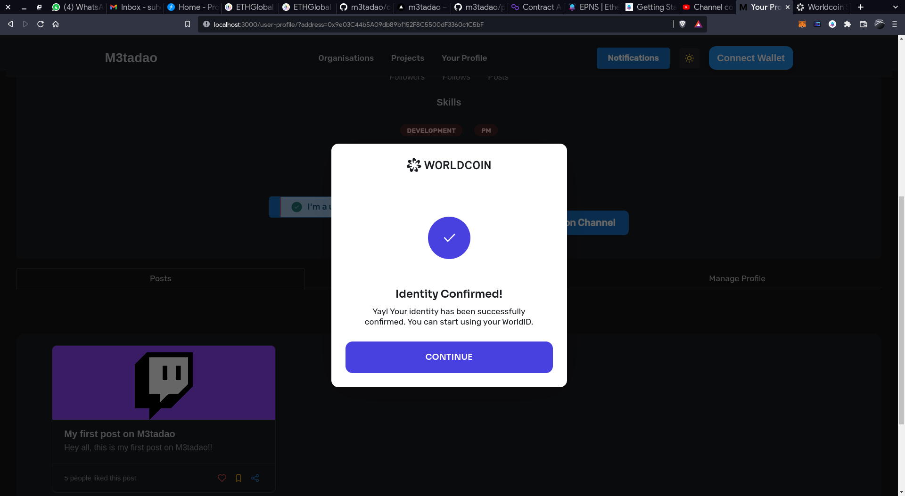

For worldcoin we are using onChain verification for Lens Protocol into that contract : https://github.com/Suhel-Kap/m3tadao/blob/mantine/contracts/contracts/HumanCheck.sol

To complete that task

1) We initiated an onChain Action on mumbai testnet using the devPortal here => https://developer.worldcoin.org/login 
   here to set the onChain, Worldcoin asks for a SmartContract that implements Worldcoin onchain Verification our contract implements the 
   WorldCoin x Lens PROTOCOL Contract named HumanCheck ours is lacated here => https://github.com/Suhel-Kap/m3tadao/blob/mantine/contracts/contracts/HumanCheck.sol
   and on mumbai testnet also veryfied here => https://mumbai.polygonscan.com/address/0x55b2DeA8Dc93aD48908FB9BBf3e26EB58cC79b02#code
   
2) We made the WorldCoin Component to first call the Worldcoin Widget(https://id.worldcoin.org/docs/js) take the verifiedResponse that contains the        (Root,NullifierHash and the Proof). This is accomplised by redirecting our users to the simulator and on succesfull User verification take the VerifiedResponse. 
   for the proof we used the decode function to unpack the VerifiedResponse.proof into a array and then we are interacting with our HumanCheck contract by calling 
   the Verify function. + (Consider that HumanCheck Verify function also needs as input the userLensProfileID)
   The Worldcoin component that contains the widget and the unpack(decode) function is located here : 
   
   https://github.com/Suhel-Kap/m3tadao/blob/worldcoin/components/Worldcoin/Worldcoin.js
   
   The contract interaction hook is located here : 
   
   https://github.com/Suhel-Kap/m3tadao/blob/worldcoin/hooks/useWorldcoin.js
   
   
  Here is a screenshot of a verified profile => 
  
  

